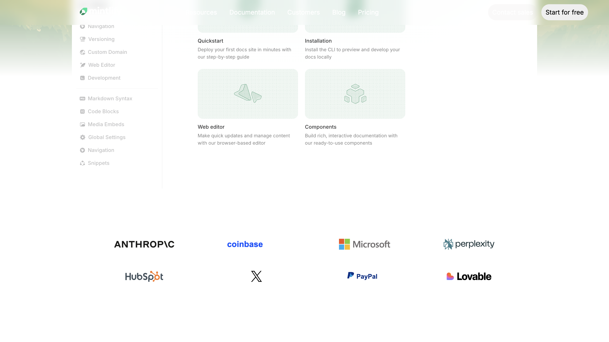
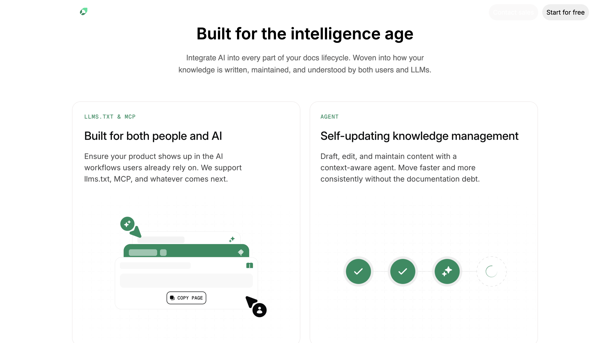
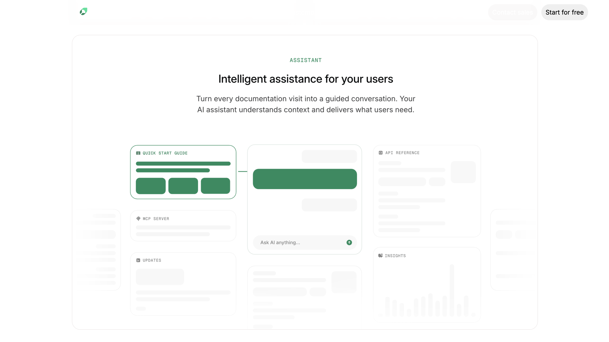
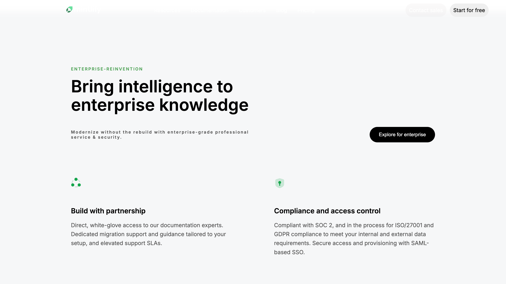
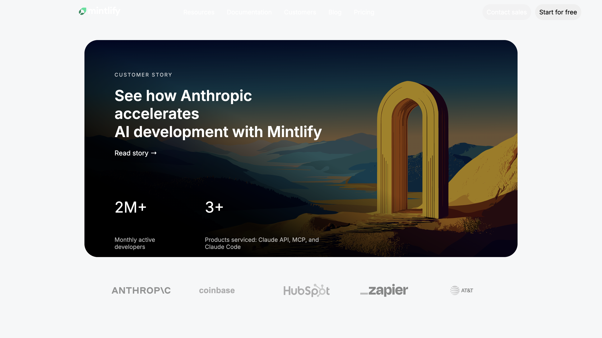
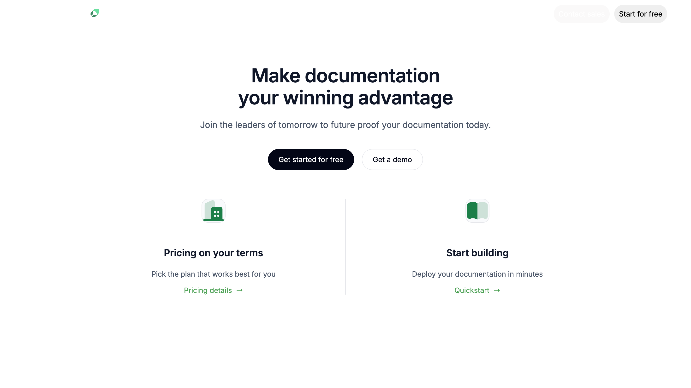
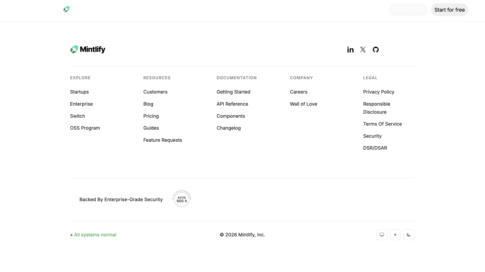

# 🚀 Cohort Mintlify Clone

A modern **desktop-only clone** of the Mintlify website built using pure **HTML & CSS**.  
This project was created to practice real-world UI layouts, spacing systems, and frontend structuring.

🌐 **Live Website:**  
👉 https://parth-mintlify-clone.netlify.app  

---

## ✨ Features

✅ Clean Mintlify-inspired UI  
✅ Built with only HTML & CSS  
✅ Desktop optimized design  
✅ Organized asset structure  
✅ Modern typography & layout  
✅ Deployed on Netlify  

---

## 🛠 Tech Stack

- HTML5  
- CSS3  
- Netlify (Hosting)

---

## 📁 Project Structure

cohort-mintlify-clone/
│
├── Assets/
├── index.html
├── style.css
├── README.md
├── screenshot1.png
├── screenshot2.png
├── screenshot3.png
├── screenshot4.png
├── screenshot5.png
├── screenshot6.png
├── screenshot7.png
├── screenshot8.png
├── screenshot10.png


---

## 🖥 Website Preview

### Homepage


---

### UI Sections





---

### Layout Details





---

### Final View




---

## 🎯 Purpose of This Project

This project helped me learn:

- Professional website cloning  
- CSS layouts & positioning  
- Asset management  
- Clean folder structuring  
- Static site deployment  
- Real frontend workflow  

---
## ⚠️ Important Notes

🔹 Desktop only (not responsive yet)  
🔹 Educational project  
🔹 Design credits belong to **Mintlify**  
---

## 👨‍💻 Author
Parth Kumbhar
Frontend Developer | Learning Full Stack
If you liked this project, don’t forget to ⭐ the repo!

## 🚀 Run Locally


---

```bash
git clone https://github.com/your-username/cohort-mintlify-clone.git


